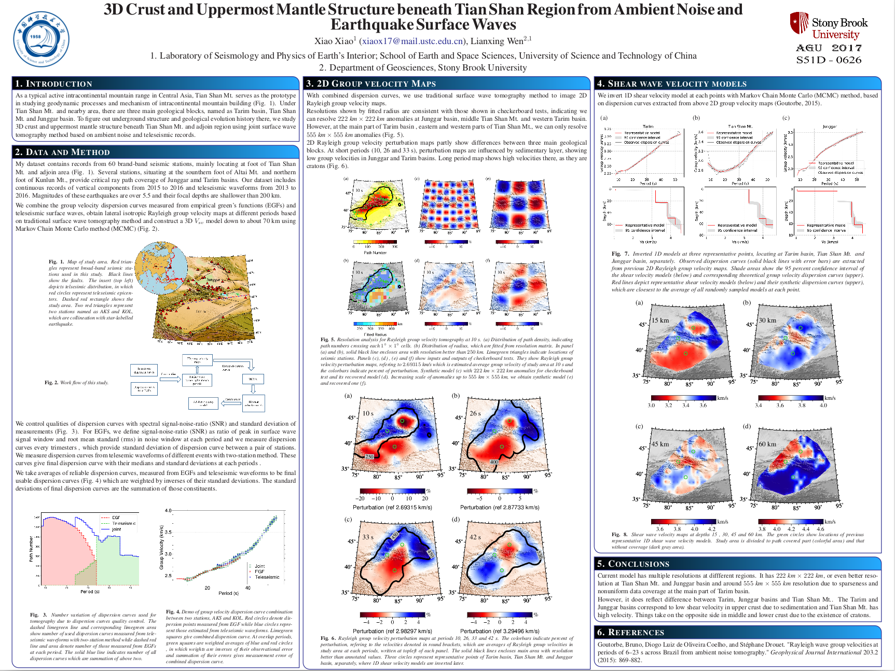

## 3D Crust and Uppermost Mantle Structure beneath Tian Shan Region from ambient noise and earthquake surface waves

**Abstract**: [S51D-0626](https://agu.confex.com/agu/fm17/meetingapp.cgi/Paper/232020)

**Session**: [Theoretical and Computational Frontiers in Seismic Tomography](https://agu.confex.com/agu/fm17/preliminaryview.cgi/Session22396)

**When:** Friday, 15 December 2017 | 08:00 - 12:20

**Where:** Poster Hall D-F

**Download raw PDF poster**: 

## Abstract
As a typical active intracontinental mountain range in Central Asia, Tian Shan Mt serves
as the prototype in studying geodynamic processes and mechanism of intracontinental mountain building.
We study 3D crust and the uppermost mantle structure beneath Tian Shan region using ambient noise
and earthquake surface waves. Our dataset includes vertical component records of 62 permanent broadband
seismic stations operated by the Earthquake Administration of China.

Firstly, we calculate two-year stacked Cross-Correlation Functions (CCFs) of ambient noise records between the stations.
The CCFs are treated as the Empirical Green’s Functions (EGFs) of each station pair, from which we measured phase velocities
of fundamental-mode Rayleigh wave in the period of 3–40 s using a frequency-time analysis method.
Secondly, we collect surface wave data from tele-seismic events with Mw > 5.5 and depth shallower than 200 km and
measure phase velocities of the fundamental-mode of Rayleigh wave in the period of 30–150 s using a two-station method.
Finally, we combine the phase velocity measurements from ambient noise and earthquake surface waves,
obtain lateral isotropic phase velocity maps at different periods based on tomography and invert a 3D Vsv model
of crust and uppermost mantle down to about 150 km using a Monte Carlo Inversion method.
We will discuss our inversion results in detail, as well as their implications to the tectonics in the region.
