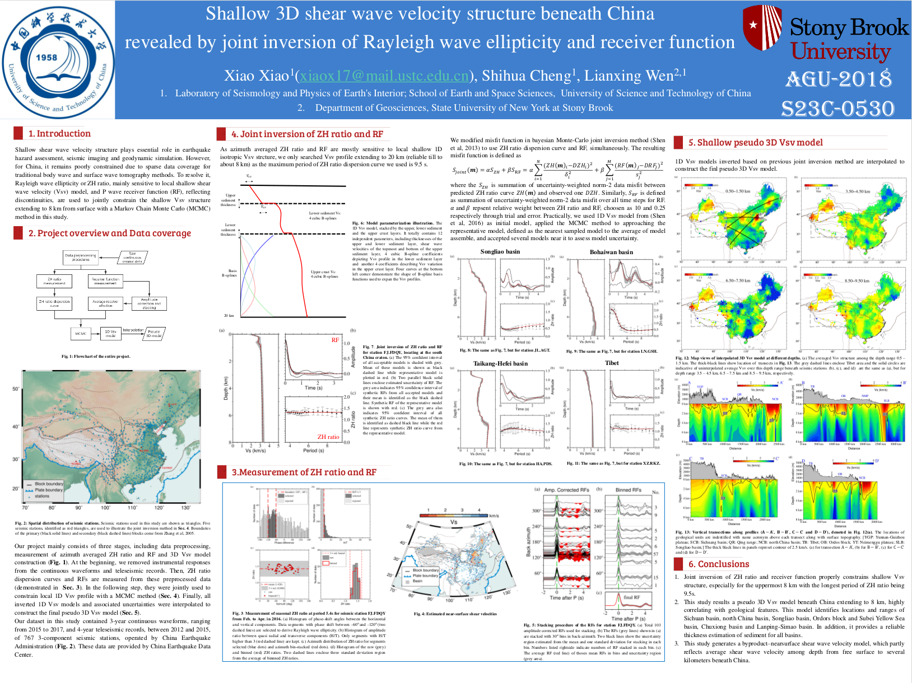

## Shallow seismic structure beneath China revealed by body-wave polarization and Rayleigh-wave ellipticity. 

**Abstract**: [S23C-0530](https://agu.confex.com/agu/fm18/meetingapp.cgi/Paper/388193)

**Session**: [Site Characterization Using Single-Station and Array Methods Posters](https://agu.confex.com/agu/fm18/meetingapp.cgi/Session/46442)

**When:** Tuesday, 11 December 2018 | 13:40 - 18:00

**Where:** Poster Hall A-C

**Download raw PDF poster**: 

## Abstract
Imaging shallow seismic structure can help better assessment of earthquake-induced ground-shaking and more accurate construction of seismic models at depth. In this study, we image the shallow seismic velocity structure beneath China using body-wave polarization and Rayleigh-wave ellipticity, which are sensitive to shallow seismic velocity structures. In body-wave polarization analysis, we measure the polarization directions of teleseismic P, S and SKS phases from three-component records of a seismic station, based on a principle component analysis (PCA) method. Based on fitting those polarizations, we estimate near-surface P and S velocities and their uncertainties beneath each station, using a Markov Chain Monte Carlo (MCMC) method. Seismic data are obtained at over 900 permanent seismic stations in China from more than 400 deep earthquakes (depth > 60 km) with Mw > 5.5, occurring between Jan. 2012 and Dec. 2017. The obtained S velocities range from 0.3 to 4.2 km/s with an average uncertainty 0.13 km/s. Over 80% of the S velocities have uncertainties below 0.3 km/s. In contrast, the average uncertainty of P velocity is 0.47 km/s and 88.6% of the uncertainties are below 0.7 km/s. The near-surface seismic wave velocities are geographically correlated with sediment thickness, with most of the thick sediments corresponding to low seismic velocities. In the second step, Rayleigh-wave ellipticity is measured based on seismic noise data and the measured ellipticity dispersion is used to inferring near-surface velocity structures. The Rayleigh-wave ellipticity ZH (vertical/horizontal) ratio dispersion curves of those permanent seismic stations are measured based on 2-year continuous three-component seismic noise records, in a frequency range from 0.1 to 0.3 Hz. To fit the observation, we discretize 1D model with several finite layers over a half-space homogenous layer, with the near-surface seismic velocity specified as a prior probability distributions of P and S velocities inferred from the polarization data. We then obtain a posterior probability distribution of accepted 1D models based on the MCMC method and estimate the final 1D model and its uncertainty. We will discuss the implications of our inferred shallow seismic structures on seismic hazard assessment and construction of a reference crustal model.
