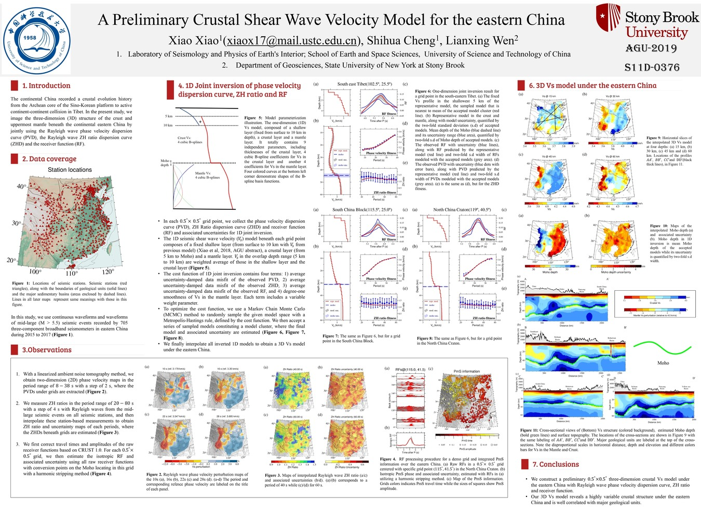

## A Preliminary Crustal Shear Wave Velocity Model for the continental China 

**Abstract**: [S11D-0376](https://agu.confex.com/agu/fm19/meetingapp.cgi/Paper/581056)

**Session**: [Ambient-Noise Seismology VI Posters](https://agu.confex.com/agu/fm19/meetingapp.cgi/Session/87525)

**When:** Monday, 9 December 2019 | 8:00 - 12:00

**Where:** Poster Hall Moscone South

**Download raw PDF poster**: [AGU2019](./AGU2019.pdf)

## Abstract
The continental China recorded a crustal evolution history from the Archean core of the Sino-Korean platform to active continent-continent collision in Tibet. In the present study, we image the three-dimension (3D) structure of the crust and uppermost mantle beneath the continental China by jointly using Rayleigh wave group/phase velocity dispersion curve, Rayleigh wave ellipticity and receiver function (RF). Our datasets include three-year (2015–2017) continuous waveforms of 929 permanent broadband seismic stations of the China National Seismic Networks. Rayleigh wave dispersion curves are obtained from ambient noise records by a tomography method. Rayleigh wave ellipticities are measured from the surface waves of the shallow earthquakes (M > 6 and with a source depth shallower than 60 km). And RFs are computed from more than 724 tele-seismic events (M > 5.5 and in an epicenter distance from 30 degree to 95 degree). After these constraints are constructed, we use the Markov Chain Monte Carlo method to search the 1D shear wave velocity (Vs) profile beneath each seismic station that would best fit the Rayleigh wave group/phase velocity dispersion curve, Rayleigh wave ellipticity and RF. The associated Vs uncertainty of each seismic profile is also estimated in the procedure. A high-resolution 3D Vs model is obtained by interpolating the inverted 1D Vs profiles beneath all seismic stations with a near neighbor algorithm. We will discuss our inversion results in detail, as well as their implications for understanding the tectonics of the region.